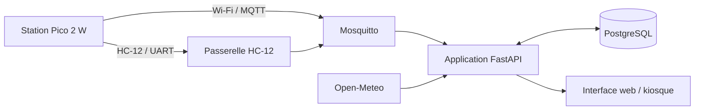
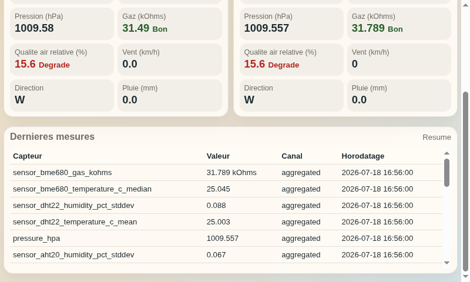
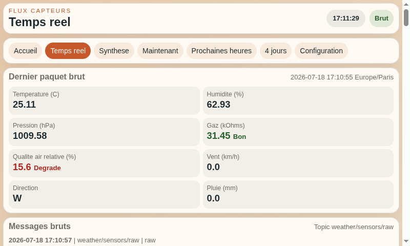
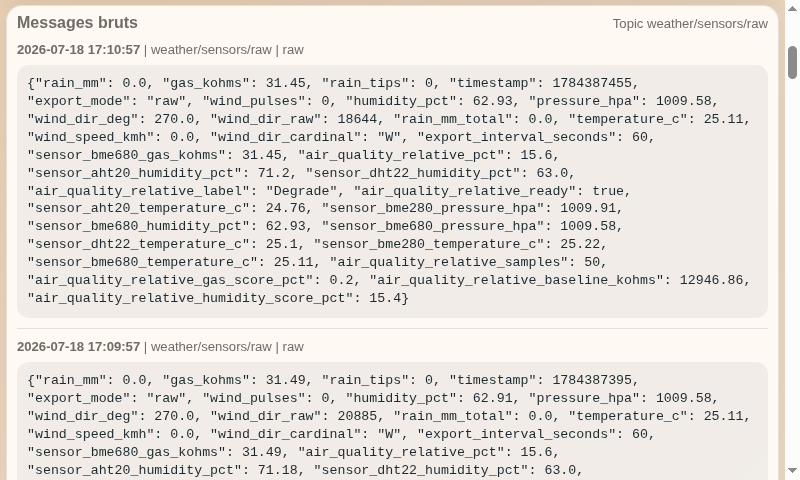
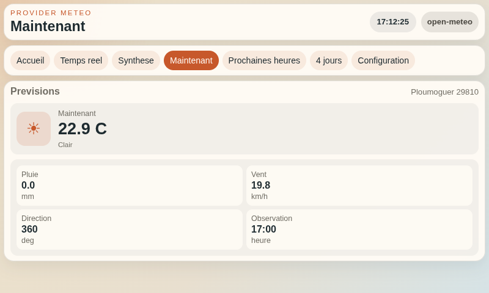
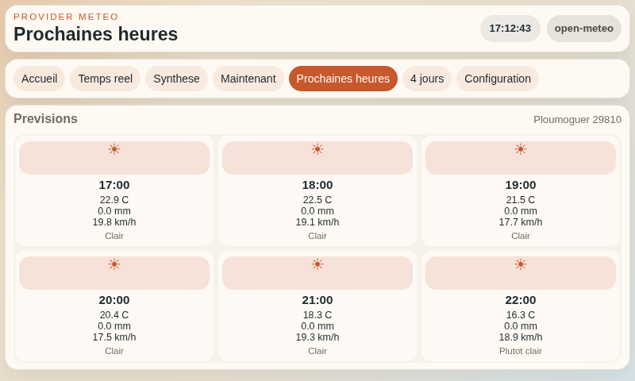
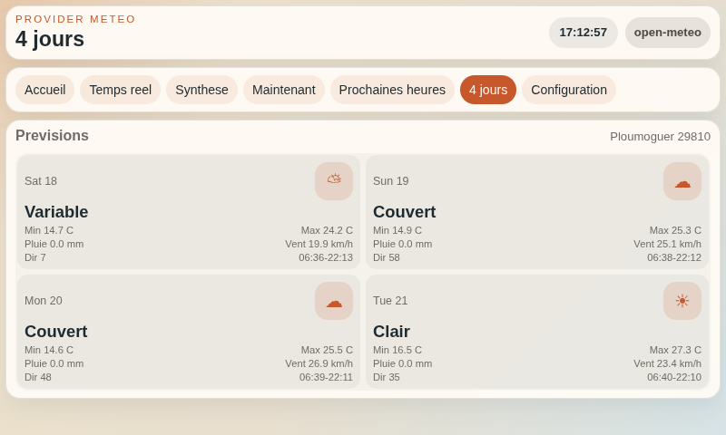
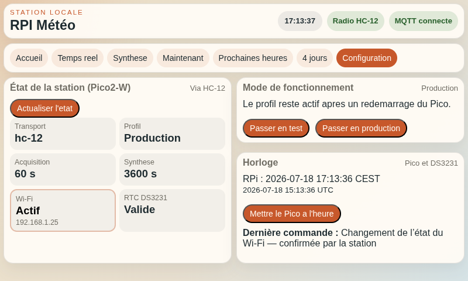
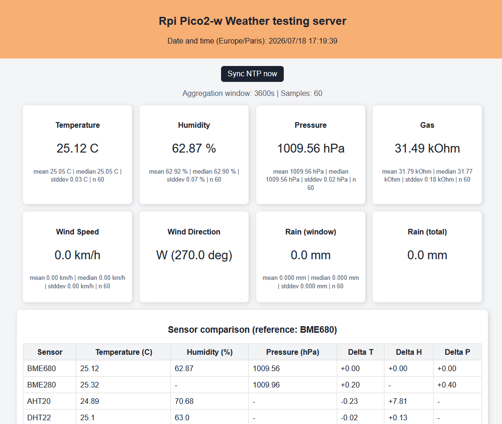

# rpi-meteo

Tableau de bord météo tactile conçu pour un **Raspberry Pi**. Il reçoit les mesures de la station `weather_web_sensors`, les conserve dans PostgreSQL et les combine avec des prévisions météo dans une interface adaptée au mode kiosque.

Le projet devait initialement fonctionner sur un Raspberry Pi 3 avec son écran officiel de 7 pouces. Ses ressources se sont révélées insuffisantes : le boîtier a donc été adapté pour accueillir un Raspberry Pi 4 doté de 4 Go de mémoire, nettement plus réactif. Les données locales proviennent de la station [Pico 2 W `weather_web_sensors`](https://github.com/jgrelet/weather_web_sensors).

## Objectifs

- centraliser les mesures locales reçues par MQTT ou radio HC-12 ;
- distinguer les acquisitions brutes des statistiques agrégées ;
- conserver l'historique dans PostgreSQL ;
- afficher mesures, tendances et prévisions sur un petit écran tactile ;
- permettre la configuration et le diagnostic de la station distante.

## Architecture



L'application FastAPI reçoit les messages, calcule les indicateurs locaux et sert l'interface. Mosquitto, PostgreSQL et l'application peuvent être lancés ensemble avec Docker Compose.

## Aperçu complet de l'interface

### Accueil

| Vue générale | Dernières mesures |
| --- | --- |
|  |  |

### Temps réel et synthèse

| Mesures en temps réel | Messages MQTT bruts | Statistiques agrégées |
| --- | --- | --- |
|  |  |  |

### Prévisions

| Maintenant | Prochaines heures | Quatre jours |
| --- | --- | --- |
|  |  |  |

### Configuration

| Station et profil | Accès Wi-Fi temporaire |
| --- | --- |
|  |  |

### Interface embarquée de la station associée



## Démarrage rapide

```bash
cp .env.generic .env
docker compose up -d --build
```

Après avoir renseigné au minimum la localisation et les identifiants de base de données dans `.env`, ouvrir `http://127.0.0.1:8000`. Les secrets et valeurs propres au site ne doivent pas être versionnés.

## Projet associé

La station d'acquisition est développée dans [`weather_web_sensors`](https://github.com/jgrelet/weather_web_sensors). Les modes de transport doivent être cohérents : `TRANSPORT_MODE` côté Pico et `RPI3_METEO_TRANSMISSION_MODE` côté Raspberry Pi.

## Documentation technique

- [Accueil du wiki](docs/wiki/Home.md)
- [Référence technique complète](docs/wiki/Technical-reference.md)
- [Validation de la liaison HC-12](docs/wiki/HC12-validation.md)
- [Mémo Docker et PostgreSQL](docs/wiki/Docker-and-PostgreSQL.md)

Ces pages restent consultables dans le dépôt et sont destinées au [wiki GitHub du projet](https://github.com/jgrelet/rpi3-meteo/wiki).
